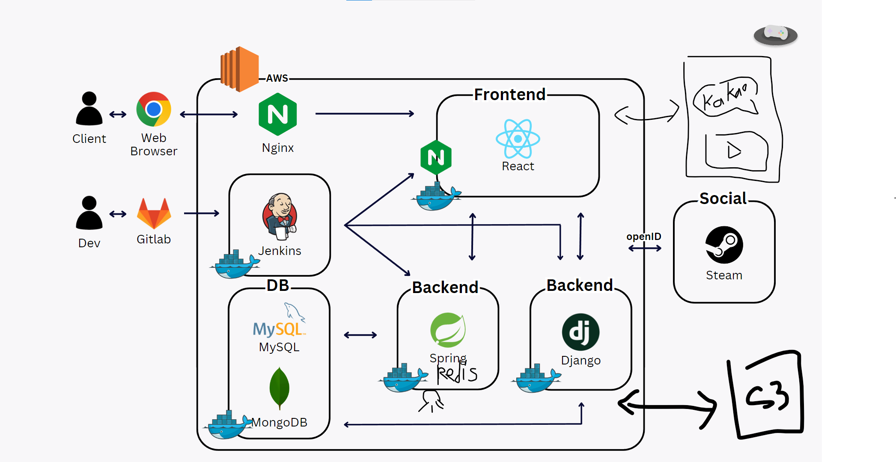
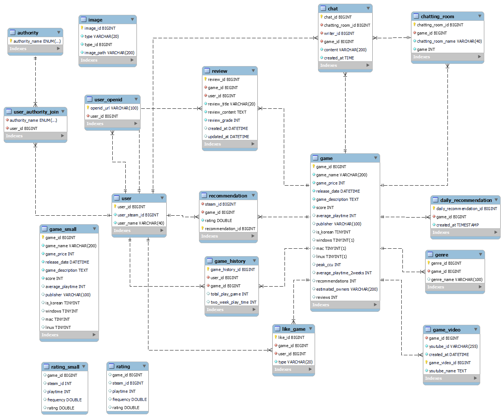

# Gamemakase 

> [0. 프로젝트 개요](#0-프로젝트-개요)
> 
> [1. 서비스 및 기능 소개](#1-서비스-및-기능-소개)
> 
> [2. 서비스 화면](#2-서비스-화면)
>   
> [3. 시스템 아키텍처](#3-시스템-아키텍처)
> 
> [4. 개발 환경](#4-개발-환경)
> 
> [5. 컴포넌트 구성도 및 Figma](#5-컴포넌트-구성도-및-figma)
> 
> [6. ERD](#6-erd)
>
> [7. 빅데이터 & 추천 알고리즘](#7-빅데이터--추천-알고리즘)
> 
> [8. 서비스 및 기술 특장점](#8-서비스-및-기술-특장점)
> 
> [9. 멤버 및 회고](#9-멤버-및-회고)

## 0. 프로젝트 개요

✔ 프로젝트명 : Gamemakase(겜마카세)

✔ 한줄 소개 : 빅데이터를 기반으로 한 개인 맞춤형 스팀 게임 추천 서비스를 제공하는 종합 게임 커뮤니티

✔ 개발 기간 : 23.02.27 ~ 23.04.08 (6주)

✔ 팀원 : 유선준 김도윤 곽민주 성예빈 장정민 정진수

✔ 사용 기술스택 : SpringBoot, React, Django, Docker, AWS + (4. 시스템 아키텍처 참고)

## 1. 서비스 및 기능 소개

✔ **맞춤형 게임 추천**
- 사용자의 스팀 계정과 연동해 플레이 내역에 기반한 알고리즘 기반 추천 게임이 제공됩니다.
- 추천 내역은 (플레이 내역에 변동이 있을 경우) 24시간마다 갱신됩니다.

✔ **인기 게임 / 랜덤 게임 / 오늘의 게임 추천**
- 비로그인 유저 / 플레이 기록이 없는 유저를 위한 인기게임, 랜덤 게임, 오늘의 게임 추천 서비스가 제공됩니다.
- **인기게임**은 Peak CCU((Peak Concurrent Users, 최고 동시 접속자 수)를 기준으로 제공됩니다.
- **랜덤게임**은 평점이나 추천 수에 기반해서 다양한 게임들이 랜덤으로 계속 제공됩니다(무한 스크롤 적용)
- **오늘의 추천 게임**은 24시간마다 db에서 스케줄링을 통해 평점, 추천 수, 유저 수 등의 데이터를 기반으로 일별로 5개의 게임이 제공됩니다.

✔ **게임 정보 및 커뮤니티**
- 게임별 상세 페이지에서 각 게임에 대한 상세한 정보를 제공합니다
  - 제공 정보: 제목, 설명, 가격, 장르, 선호도, 운영체제, 스크린샷, 공략 영상 등
- 각 게임별로 3개의 채팅방(일반 / 정보공유 / 친구 찾기)이 존재하며 실시간 채팅 기능을 제공합니다.
- 해당 게임에 대한 스크랩 기능을 제공합니다.
- 자기가 보유하고 있는 게임에 대해 리뷰를 작성할 수 있습니다.
- 해당 게임을 플레이한 유저를 확인할 수 있습니다.

✔ **게임 / 유저 검색**
- 키워드 및 조건을 통한 게임 / 유저 검색 기능을 제공합니다.
- 가격, 장르, 한국어 지원 여부 등으로 검색 결과를 필터링 할 수 있습니다.

✔ **프로필**
- 사용자의 실제 스팀 계정과 연동해 프로필 서비스를 제공합니다.
- 사용자의 플레이 기록에 대한 분석과 시각화 서비스를 제공합니다.
- 사용자가 '겜마카세' 서비스 내에서 작성한 리뷰와 스크랩 내역을 확인할 수 있습니다.

✔ **게임 성향 테스트**
- 비로그인을 포함한 전체 사용자에게 게임 성향 테스트를 제공합니다.
- 테스트를 통해 나에게 맞는 장르와 해당 장르의 추천 게임을 제공합니다.
- 공유하기 기능을 통해 다른 사람에게 테스트 결과를 공유할 수 있습니다.

## 2. 서비스 화면

### 가입 및 로그인

- 로그인 화면
- 스팀 화면
- 추천결과 로딩 화면
- 메인화면 리다이렉트

### 메인 화면 (게임 추천)
- 맞춤 추천
- 없는 경우
- 안내 페이지
- 인기게임
- 오늘의게임
- 랜덤게임
- 무한스크롤
  
### 상세 페이지
- 상세페이지 위쪽 (헤더, 설명, 운영체제 보유 여부, 스크랩 여부)
- 상세 페이지 중간(평점, 가격, 장르)
- 상세 페이지 하단(스샷, 영상)
- 유저 추천
- 리뷰 작성

### 검색 페이지
- 게임 검색
- 유저 검색
- 조건별 검색

### 프로필 페이지
- 분석 내역
- 없는 경우
- 스크랩
- 리뷰

### 성향 테스트
- 메인화면
- 성향테스트 시작
- 성향테스트 중간
- 성향테스트 끝
- 결과 공유

## 3. 시스템 아키텍처

## 4. 개발 환경

개발환경 표

## 5. 컴포넌트 구성도 및 Figma

컴포넌트 구성도 이미지

### Figma

**클릭해서 확대*

## 6. ERD

**클릭해서 확대*

## 7. 빅데이터 & 추천 알고리즘

✔ Data Size:
- 게임: 12,000개
- 리뷰: 1,100,000개
  
✔ 적용 알고리즘
- 코사인 유사도(Cosine-Similarity)를 활용한 KNN 알고리즘

✔ [자세한 설명 보기(.md 파일)](assets/%EC%B6%94%EC%B2%9C%20%EC%95%8C%EA%B3%A0%EB%A6%AC%EC%A6%98.md)

> 1. 데이터 추출 및 정제 과정
> 2. 추천 알고리즘(KNN) 설명
> 3. 프로젝트 내 추천 알고리즘 작동 원리
> 4. 추천 스케줄링

## 8. 서비스 및 기술 특장점

1. '추천'이라는 테마에 걸맞는 로고 및 컨셉추얼하며 통일감 있는 디자인 
   
2. UX를 고려한 사용자 친화적 프론트 화면 구성(제일 위로 가기 / 안내 페이지 등)

3. 풍부한 데이터(게임: 12,000 / 리뷰: 1,100,000 여 개)를 바탕으로한 개인 맞춤형 추천 알고리즘

4. 비로그인 및 플레이 기록이 없는 유저를 위한 범용 추천 서비스 제공

5. Open ID를 활용한 스팀 계정 소셜 로그인 및 실시간 데이터 연동

6. 게임에 대한 상세 정보 및 외부 API(YouTube)을 활용한 게임 정보 커뮤니티로서의 기능 제공 
   
6. 데이터 및 서비스의 특징에 따른 3가지의 다른 DB(MySQL, MongoDB, Redis) 사용

7. 효과적인 추천 서비스 제공을 위한 서버 / DB 스케줄링 및 자동화

8. WebSocket을 활용한 실시간 채팅 기능 제공 및 NoSql을 활용한 채팅 데이터 저장 및 연속적 서비스 제공

9. 자체적인 성향 테스트 및 외부API(KaKao)를 활용한 공유 서비스 제공

## 9. 멤버 및 역할

<table>
  <tr> 
    <td align="center"><a href="https://github.com/Bluuubery"> <b>유선준</b></a> </td>
    <td align="center"><a href="https://github.com/skyju"> <b>곽민주</b></a> </td>      
    <td align="center"><a href="https://github.com/DooDoo3804"> <b>김도윤</b></a> </td>     
    <td align="center"><a href="https://github.com/e-bing"> <b>성예빈</b></a> </td>     
    <td align="center"><a href="https://github.com/Jung-jin-su"> <b>정진수</b></a> </td>     

  </tr>
</table>

✔ 유선준
- Java 및 Springboot를 활용한 Backend REST API 서버 구현
- Docker 및 Docker-compose를 통한 프로젝트 빌드 및 배포
- Jenkins를 활용한 CI/CD 구축
- AWS EC2 및 Nginx 서버 관리
- MySQL DB 관리 및 스케줄링
- Python을 활용한 데이터 수집 및 전처리
- Python 및 Django를 활용한 코사인 유사도 기반 KNN 추천 알고리즘 구현
- 프로젝트 발표 및 문서화

✔ 곽민주
- Java 및 SpingBoot를 활용한 Backend REST API 서버 구현
- 검색 기록 저장을 위한 Redis 구성 및 적용
- Figma를 활용한 와이어프레임 및 디자인 구성
- React를 활용한 Front페이지 구현 (프로필 페이지, 검색 페이지 구성 담당)
- 미디어 쿼리를 적용한 CSS 구현
- Framer motion을 활용한 애니메이션 적용
- 카카오톡 공유하기 기능 적용

✔ 김도윤
- Java 및 Springboot를 활용한 Backend REST API 서버 구현
- Docker 및 docker-compose를 통한 프로젝트 빌드 및 배포
- Jenkins를 활용한 CI/CD 구축
- AWS EC2 및 Nginx 서버 관리
- python 데이터 수집 및 전처리
- MySQL DB 관리
- 추천 알고리즘 Django 프로젝트에 적용
- Django 추천 시스템 스케줄링 적용
- 포팅 메뉴얼 문서화

✔ 성예빈
- Figma를 활용한 와이어프레임 디자인 및 프로토타이핑
- React, Framer-motion을 사용한 Frontend 페이지 구현
- Recoil, Cookie를 통한 로그인/로그아웃 및 유저 상태 관리
- emotion/styled 라이브러리로 CSS-in-JS 활용
- 미디어쿼리를 적용하여 반응형 웹사이트 구현
- WebSocket 활용 게임 별, 채널 별 채팅 Frontend 구현

✔ 정진수
- SpringBoot를 활용한 REST API 구현
- MySQL DB 설계
- MongoDB 설계 및 관리하여 채팅 기능 구현
- Steam API 활용하여 추천에 필요한 회원 정보 데이터 추출
- Steam OpenID 활용하여 Steam 계정 연동 구현
- Backend Spring Security 적용
- AWS S3 환경 구성

✔ 장정민
- Backend JWT 발급 및 관리 로직 구성

     
